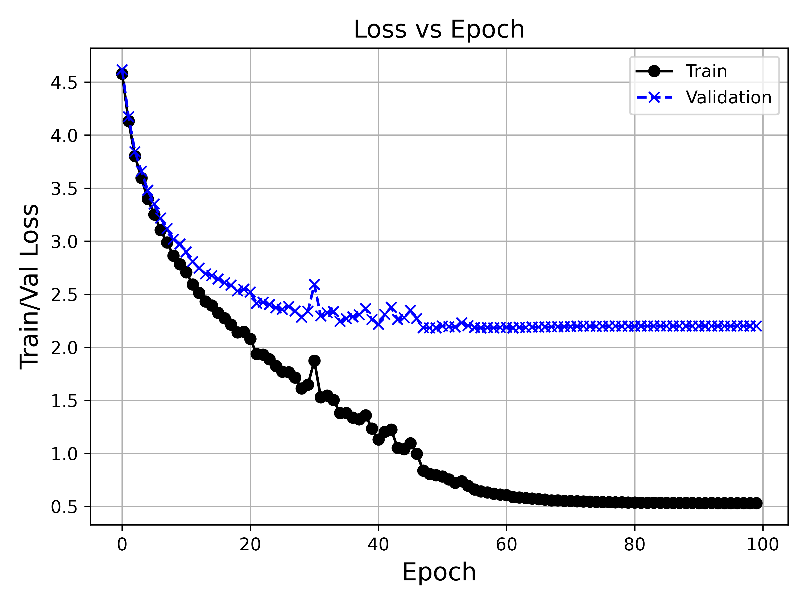
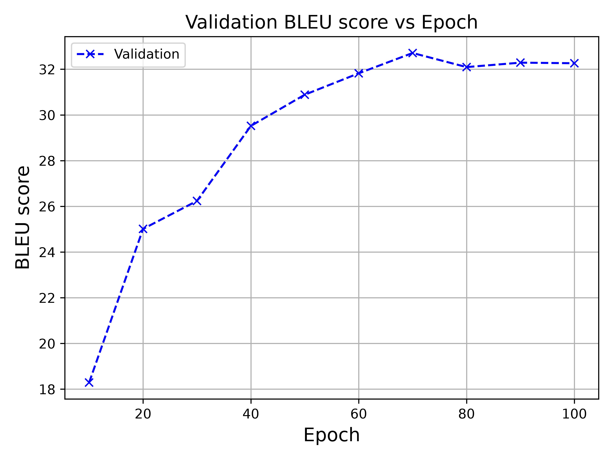

# Mini-project: transformer implementation from scratch in pytorch
## Project Overview
This mini-project implements an encoder–decoder Transformer from scratch using core PyTorch components and trains it on the Multi30K German-to-English translation task. The implementation includes scaled dot-product attention, multi-head attention, positional encoding, causal/padding masks, and autoregressive decoding, without using nn.Transformer or nn.MultiheadAttention.

The goal of this mini-project is to strengthen my PyTorch implementation skills and deepen my understanding of the Transformer architecture.

## Architecture Implemented
- scaled dot-product attention
- multi-head attention
- encoder/decoder
- positional encoding
- causal and padding masks
- autoregressive decoding

Note that these are implemented without nn.Transformer / nn.MultiheadAttention.

## Dataset and Training
- Dataset: [Multi30K German-to-English translation task](https://huggingface.co/datasets/bentrevett/multi30k)
    - Train: 29,000 German-English sentence pairs
    - Validation: 1,014
    - Test: 1,000
- Architecture: Encoder-Decoder Transformer
    - Encoder Blocks: 3
    - Decoder Blocks: 3
    - Embedding Size: 256
    - Attention Heads: 8
    - Feed-Forward Hidden Dimension: 512
    - Maximum Sequence Length: 100
- Tokenizer: Google's SentencePiece tokenizer, trained on the training set.
- Vocabulary Size: 8,000 for both English and German
- Optimizer: Adam
    - Learning rate: 1e-1 initially, scheduled to reduce on plateau with factor 0.5, patience 5, and minimum learning rate 1e-4
- Batch size: 64
- Training duration: 100 epochs
- Loss function: CrossEntropyLoss
- Evaluation metric: BLEU score


## Results
<p float="left">
  
  
</p>

The training loss continued to decrease throughout the training, while the validation loss plateaued after roughly epoch 50. 
BLEU followed a similar trend, improving rapidly during early training and leveling off at around 60–70 epochs. 
The best validation BLEU was 32.7 at Epoch 70; the selected model achieved a test corpus BLEU score of 32.8.

The following are translations made by the selected model on the held-out test set:

| Source | Target | Prediction | Note | 
| :------| :----- | :--------- | :--- |
| Drei Leute sitzen in einer Höhle. | Three people sit in a cave. | Three people sitting in a cave. | The model works well on short sentences. |
| Ein Typ arbeitet an einem Gebäude. |  A guy works on a building. | A guy working on a building. | The model works well on short sentences. |
| Ein Boston Terrier läuft über saftig-grünes Gras vor einem weißen Zaun. |  A Boston Terrier is running on lush green grass in front of a white fence. | A Boston colored grass is walking across the grass field of a white fence. | The model gets part of the scene right ('grass', 'white fence') but makes mistakes in the main subject ('Boston Terrier' vs 'Boston colored grass') and the action ('running' vs 'walking') |
| Fünf Leute in Winterjacken und mit Helmen stehen im Schnee mit Schneemobilen im Hintergrund. | Five people wearing winter jackets and helmets stand in the snow, with snowmobiles in the background. | Five people in winter jackets and helmets are standing in the snow with snow in the background. | The model gets most of the scene right, but it misidentified the background object ("snowmobiles" vs "snow") |


## Running the project

This project uses [uv] for dependency management.

```bash
git clone https://github.com/yuanchimarkyang-lab/transformer-from-scratch-pytorch
cd transformer-from-scratch-pytorch
uv sync
```

Prepare the training data
```bash
uv run python prepare_data.py
```

Train the model
```bash
uv run python train.py
```

Evaluate the saved checkpoint
```bash
uv run python evaluate.py
```

Plot the training trajectory
```bash
uv run python plot_training_trajectory.py
```

Generate the translations in demo
```bash
uv run python generate_demo.py
```


## Repository structure
```text
transformer-from-scratch-pytorch/
├── transformer/
│   ├── config.py
│   ├── constants.py
│   ├── data.py
│   ├── model.py
├── result/
│   └── baseline/
├── prepare_data.py
├── train.py
├── evaluate.py
├── plot_training_trajectory.py
├── generate_demo.py
├── pyproject.toml
└── README.md
```
